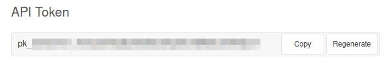
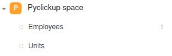
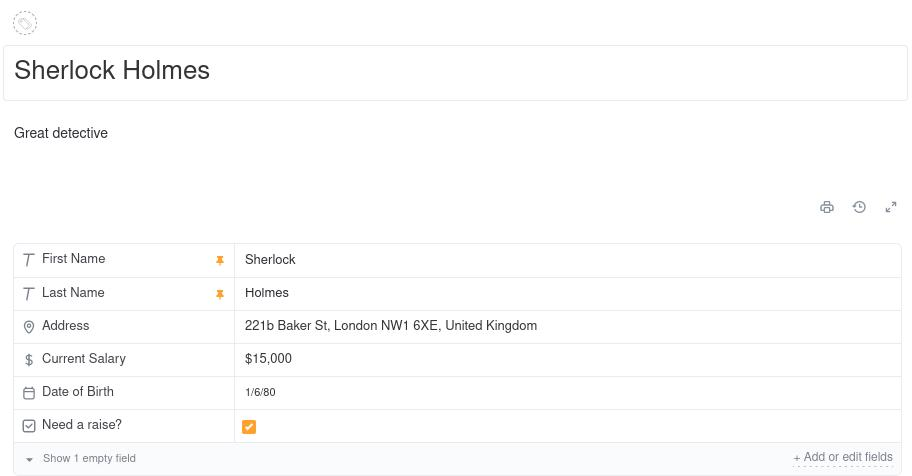
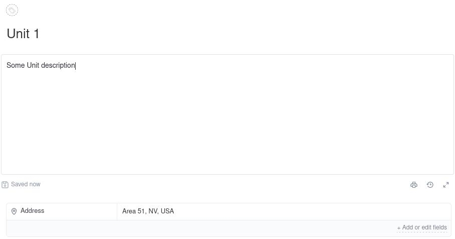
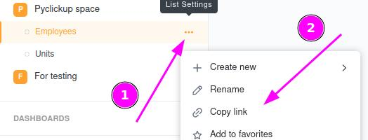

# PyClickup

PyClickup - little Python library that gives you the opportunity to wrap your ClickUp lists into Python classes. It will give an ability to manipulate (get/create/update) list's data easily.

The greatest benefit of using this library is that you do not need to think about parsing ClickUp's custom fields on your own. All you need to do is to initialize your custom class with all the required fields (see example below). 

## Initialization
All you need to do is to install the library with your package manager
```
pip install PyClickup
```

## Getting Started

### 1. ClickUp auth
First, you must provide a `CLICKUP_AUTH_TOKEN` environmental variable. You can get your token in yours ClickUp space settings (ClickUp > Settings > My Apps)


After setting `CLICKUP_AUTH_TOKEN`, you are ready to create your wrappers.

### 2. ClickUp Space example
Let's create a little ClickUp space with following hierarchy
<br>


Here is the structure of `Employees` task
<br>


and here is `Units` task
<br>


### 3. Create List wrappers
To create wrappers for your lists, you need to do the following steps:
1) Create your list class as subclass of `ClickUpList` class
2) Add `LIST_ID` class variable to your class. ([How to get LIST_ID?](#how-to-get-list_id))
3) Add required custom fields. Notice, that it is not required to set all the fields from your ClickUp list. You are free to add only useful custom fields.

Here is the example of wrappers that we can create for example space hierarchy
```python
from pyclickup import ClickUpList
from pyclickup.custom_fields import *


class Employees(ClickUpList):
    LIST_ID = <employees list id as int>

    first_name = ShortTextField(field_name="First Name")
    last_name = ShortTextField(field_name="Last Name")
    address = LocationField(field_name="Address")
    salary = CurrencyField(field_name="Current Salary")
    birth_date = DateField(field_name="Date of Birth")
    need_raise = CheckboxField(field_name="Need a raise?")

    # Relations
    units = RelationField("Units", field_name="Units")

class Units(ClickUpList):
    LIST_ID = <units list id as int>    
    
    address = LocationField(field_name="Address")

    # Relations
    employees = RelationField("Employees", field_name="Employees")
```
As you can see from the example, we have defined 2 classes that represents the structure of our ClickUp Lists. Let's have a closer look at how we define the custom fields for the lists. All the custom fields required `field_name` field that represents the name of the field in your list. Besides, `RelationField` requires additional field that stays for *name of custom list* that you like to relate with.

### 4. Usage
```python
# Get employee
employee = Employees() # Empty employee
employee = Employees.get_by_id("2hravjh") 
employee = Employees.get_by_name("Sherlock Holmes")

# Get default attributes
employee.id  # 2hravjh
employee.name  # "Sherlock Holmes"
employee.description  # "Great detective"
employee.url  # "https://app.clickup.com/t/2hravjh"

# Set new data
from datetime import datetime 

employee.first_name = "Marry"
employee.last_name = "Sue"
employee.address = "Some new valid address"
employee.salary = 1000
employee.birth_date = datetime(1, 1, 2022)
employee.need_raise = False

employee.update() # To update existed employee (employee.id MUST be provided)
employee.create() # To create new employee

# Adding relations
unit = Units.get_by_name("Unit 1")

employee.units = unit # `unit` MUST be type `Units` as we defined in Employees.units field
employee.update()

# OR

unit.employees = employee
unit.update()
```
This example does not include all the CustomFields. You can get the list of all the valid fields in `pyclickup.custom_fields` folder. 

## FAQ
### How to get LIST_ID?
Click on menu button on your list and click `Copy link`
<br>


Paste link somewhere and extract the `LIST_ID` 
<br>


